# NewWorld
## Overview
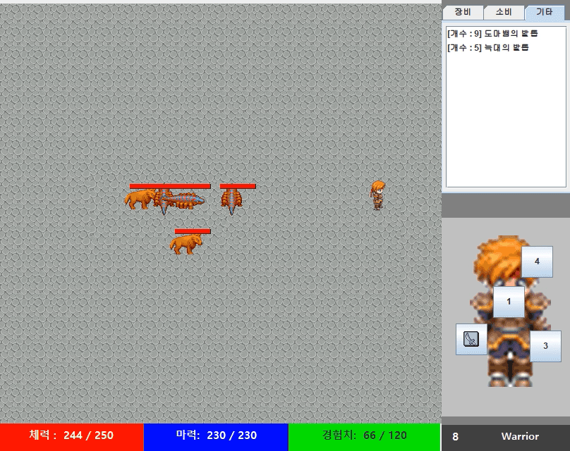|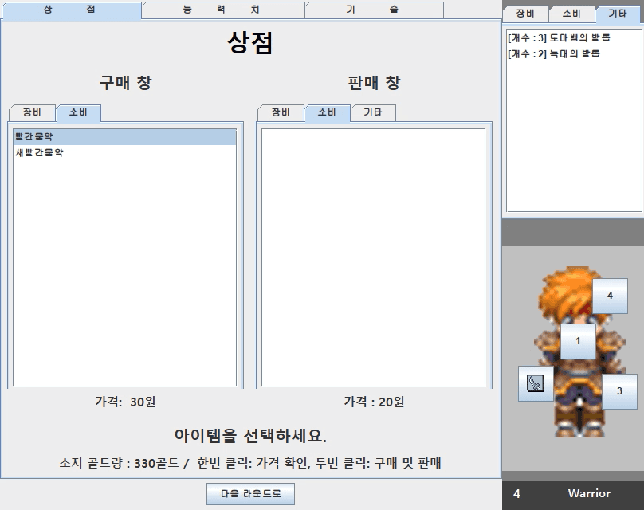
:---:|:---:

NewWorld is a Role-Playing Game with multiple stages. The goal is to reach the highest level by killing monsters. Upgrade your weapons and skills with level-ups and items!

- Move: Arrow keys
- Normal attack: Spacebar
- Skill 1: A
- Skill 2: S

## Gallery
The current version does not support all weapons. If you want to try other weapons, please use the version0 source code. Press CTRL to change weapon.
### Sword
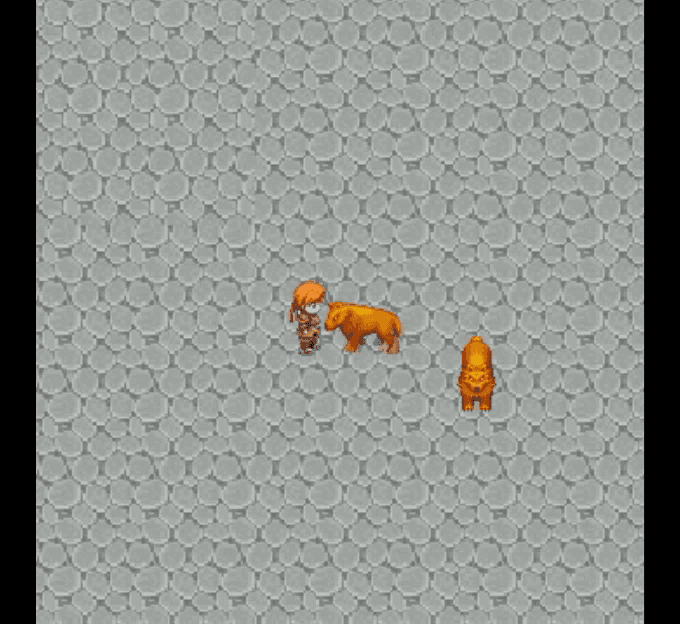||
:---:|:---:|:---:

## Dagger
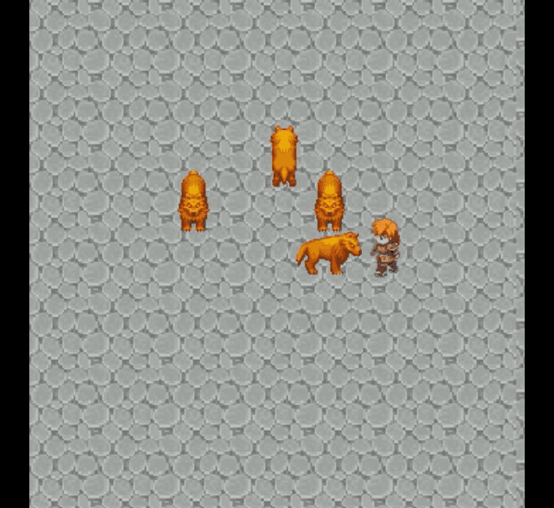|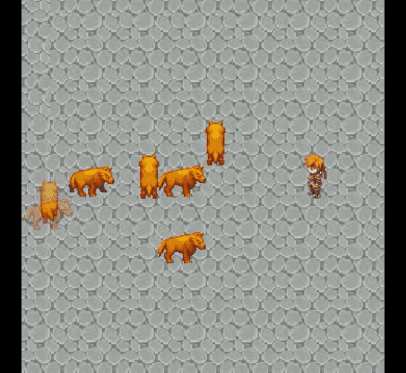|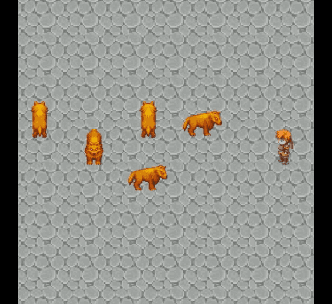
:---:|:---:|:---:

## Bow
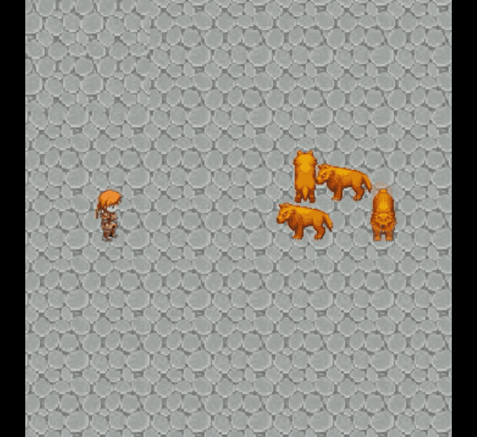|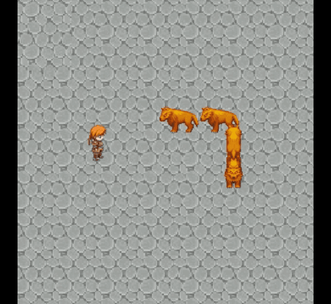|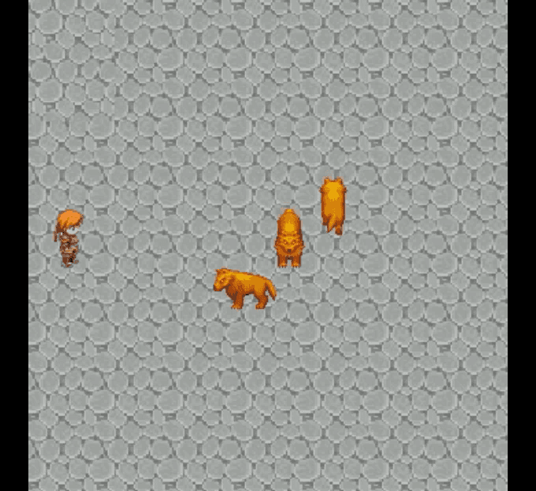
:---:|:---:|:---:

## Hammer
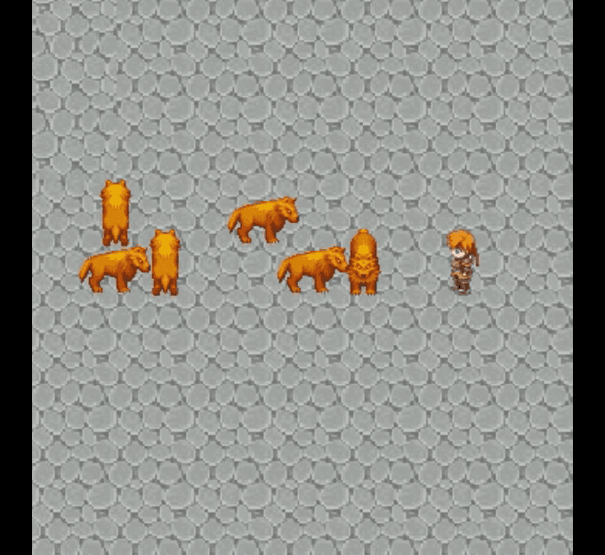|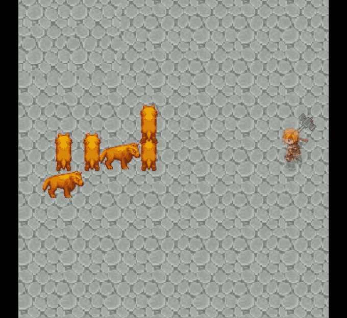|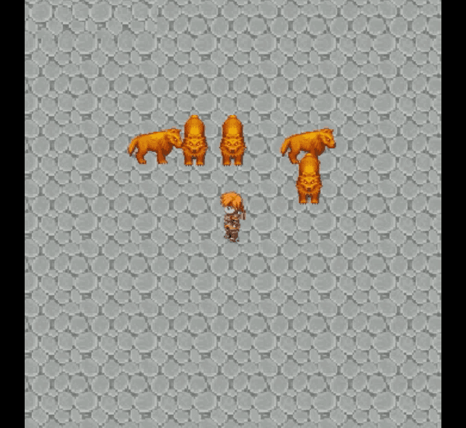
:---:|:---:|:---:
